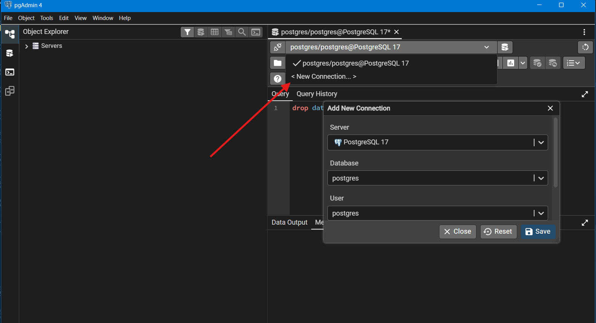

# EP_BD - Sistema de Gerenciamento de Barbearia

Este projeto é uma aplicação web que integra um backend em **Flask** e um frontend em **React**.

## 📋 Pré-requisitos

Para configurar e rodar este projeto, você precisará das seguintes ferramentas instaladas no seu ambiente:

1.  **Git**: Necessário para clonar o repositório.
* [Instalar Git](https://git-scm.com/downloads)
2.  **Python (versão 3.8+)**: Necessário para o backend Flask.
* Certifique-se de que o gerenciador de pacotes `pip` esteja instalado.
* [Instalar Python](https://www.python.org/downloads/)
3.  **Node.js (versão 14+)**: Necessário para o frontend React.
* O `npm` (gerenciador de pacotes) é instalado automaticamente com o Node.
* [Instalar Node.js](https://nodejs.org/)

---

## ⚙️ Configuração e Execução

Siga a ordem abaixo para garantir o funcionamento correto da aplicação.

### 1. Clonar o Repositório

Abra o seu terminal e clone o projeto para sua máquina:

```bash
git clone URL_DO_REPOSITORIO
cd ep_bd
````
A url pode ser obtida clicando no botão code de cor verde localizado encima da listagem dos arquivos do projeto

### 1.5 Configuração das Variáveis de Ambiente (.env)

Por questões de segurança, arquivos contendo senhas e chaves secretas não são versionados. Você precisará criar dois arquivos `.env` manualmente, um para o backend e outro para o frontend.

#### **Backend**

Crie um arquivo chamado `.env` dentro da pasta `backend/app/` (caminho: `ep_bd/backend/app/.env`) e adicione o seguinte conteúdo, ajustando os valores conforme seu ambiente:

```ini
# Configurações do Flask e Banco de Dados
SECRET_KEY=sua_chave_secreta_aqui_desenvolvimento
DB_HOST=localhost
DB_NAME=barbearia
DB_USER=postgres
DB_PASSWORD=sua_senha_do_postgres
DB_PORT=5432

# Configurações de E-mail (Para envio de notificações)
# Exemplo usando Gmail (Requer 'Senha de App' se usar 2FA)
MAIL_USERNAME=seu_email@gmail.com
MAIL_PASSWORD=sua_senha_de_app
MAIL_DEFAULT_SENDER=seu_email@gmail.com
```

> **Nota:** Se você não configurar as variáveis de e-mail, as funcionalidades de notificação poderão gerar erros.

#### **Frontend**

Crie um arquivo chamado `.env` dentro da pasta `frontend/` (caminho: `ep_bd/frontend/.env`) e adicione o seguinte conteúdo:

    ```ini
    # URL da API do Backend
    REACT_APP_API_URL=http://localhost:5000/api
    ```

### 2\. Configurando o Backend (Flask)

O backend gerencia a API e o banco de dados.

1.  **Crie um ambiente virtual (venv)** para isolar as dependências:

      * *Windows:*
        ```bash
        python -m venv venv
        venv\Scripts\activate
        ```
      * *Linux/Mac:*
        ```bash
        python3 -m venv venv
        source venv/bin/activate
        ```

2.  **Instale as dependências** listadas no arquivo `requirements.txt`:

    ```bash
    pip install -r backend/requirements.txt
    ```

3.  **Execute o servidor**:
    A partir da raiz do projeto, execute o comando abaixo para rodar a aplicação Flask:

    ```bash
    python -m backend.app.run
    ```

    Caso surja uma janela flutuante clique em permitir <br>
    *O servidor iniciará em `http://0.0.0.0:5000`*

### 3\. Configurando o Frontend (React)

O frontend gerencia a interface do usuário. Abra um **novo terminal** (mantenha o do backend rodando).

1.  **Acesse a pasta do frontend**:

    ```bash
    cd frontend
    ```

2.  **Instale as dependências** listadas no `package.json`:

    ```bash
    npm install
    ```

3.  **Inicie a aplicação**:

    ```bash
    npm start
    ```

    *O navegador abrirá automaticamente a aplicação em `http://localhost:3000`.*

### 4\. Criação do banco de dados

1. No pgAdmin ou outra plataforma que deseje **crie um banco de dados com o nome barbearia**:

    ```sql
    CREATE DATABASE barbearia;
    ```
2. **Selecione esse banco de dados \(barbearia\)** na ferramenta de execução de código SQL criando uma nova conexão conforme mostrado na figura

    

3. **Acesse o script de criação do banco de dados**:

    ```bash
    cd backend/app
    ```
    ou acesse manualmente pelo sistema de arquivos

4. **Copie o script de criação do banco de dados e cole** na ferramenta de execução de código SQL

5. **Execute o script**
